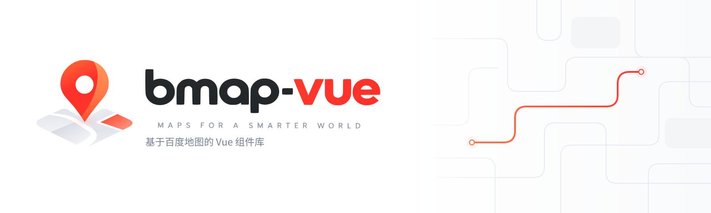

<p align="center">
  <a href="https://Mang-X.github.io/bmap-vue/zh-CN" target="_blank" rel="noopener noreferrer">
  
  </a>
</p>

<h1 align="center">&nbsp;@mangax/bmap-vue&nbsp;</h1>

<p align="center">易用 & 完整 & 高性能</p>
<p align="center">


<br />
</p>

面向 Vue 3 的百度地图组件与 hooks 库，基于百度地图 JSAPI 4.0。

<div align="center">
  
</div>

##  Star

如果喜欢这个项目，右上角给我们点个星星吧，这对我们意义非凡！


##  特性

- 🚀 自动通过官方 `@baidumap/jsapi-loader` 加载百度地图 JSAPI 4.0，将繁琐的 Api 封装进组件，你只需关注组件本身
- 📦 56 个组件（覆盖物 / 控件 / 图层 / 批量可视化 / 全景 / 检索）+ 20 个 composables
- 🌐 原生批量图层：线 / 面 / 热力 / 轨迹线，带要素状态与拾取，数据量大时渲染留在 SDK 内部
- 🔌 12 个 headless 服务 composable：地址解析、坐标转换、区域边界、检索、四种路线规划
- 🎨 标准 UI 交给官方 `@baidumap/jsapi-ui-kit`，本库不复制官方 UI
- 📐 Vue-native：`v-model` 双向绑定、具名插槽、每条监听都有释放路径
- 🔨 完整 TypeScript + Volar，公共出口冻结
- 🧩 tree shaking，按需引入组件与 hooks

##  安装

推荐使用 pnpm 安装

```bash
# with pnpm
pnpm add @mangax/bmap-vue

# or with yarn
yarn add @mangax/bmap-vue

# or with npm
npm install @mangax/bmap-vue
```

##  用法

```vue
<template>
  <Map :ak="ak" v-model:center="center" :zoom="12">
    <Marker :position="center" />
    <NavigationControl anchor="BMAP_ANCHOR_TOP_RIGHT" />
  </Map>
</template>

<script setup lang="ts">
import { ref } from 'vue'
import { Map, Marker, NavigationControl } from '@mangax/bmap-vue'
import type { Point } from '@mangax/bmap-vue'

const ak = '你的百度地图 ak'
const center = ref<Point>({ lng: 116.404, lat: 39.915 })
</script>
```

`ak` 写在 `app.use(createBMapPlugin({ ak }))` 里全局生效，`<BMapProvider>` 复用这份默认定义，
不需要（也不接受）再传一次 `ak`。它提供 Client 上下文，所以服务 composable 能在
没有 `<Map>` 的情况下单独使用。

```vue
<template>
  <BMapProvider>
    <Map :zoom="12">
      <ZoomControl />
    </Map>
  </BMapProvider>
</template>

<script setup lang="ts">
import { BMapProvider, Map, ZoomControl } from '@mangax/bmap-vue'
</script>
```

需要在多处复用同一个 `ak` 时，用全局插件注入一次即可：

```ts
import { createApp } from 'vue'
import { createBMapPlugin } from '@mangax/bmap-vue'

app.use(createBMapPlugin({ ak: '你的百度地图 ak' }))
```

要给某棵子树一份**自己的**定义（而不是应用级默认），传 `provider` 与 `loadOptions`
（或整个 `definition`）。`loadOptions` 只在**同时**传了 `provider` 时被读取：

```vue
<template>
  <BMapProvider :provider="provider" :load-options="loadOptions">
    <Map :zoom="12">
      <ZoomControl />
    </Map>
  </BMapProvider>
</template>

<script setup lang="ts">
import { BMapProvider, ZoomControl } from '@mangax/bmap-vue'
import { baiduJsapiV4Provider } from '@mangax/bmap-vue/advanced'

const ak = '你的百度地图 ak'
const provider = baiduJsapiV4Provider()
const loadOptions = { ak }
</script>
```

地图 SDK 由本库默认通过官方 `@baidumap/jsapi-loader` 加载，不需要手动引脚本。

##  文档

[中文文档](https://Mang-X.github.io/bmap-vue/)

- [安装](https://Mang-X.github.io/bmap-vue/zh-CN/guide/installation)
- [快速开始](https://Mang-X.github.io/bmap-vue/zh-CN/guide/quick-start)
- [组件总览](https://Mang-X.github.io/bmap-vue/zh-CN/components/)
- [Headless 服务](https://Mang-X.github.io/bmap-vue/zh-CN/guide/services)
- [与官方库的关系](https://Mang-X.github.io/bmap-vue/zh-CN/guide/comparison)

##  开发参与贡献

```bash
# 环境
# pnpm >= 12.0.0
# node >= 24.0.0

# clone
git clone https://github.com/Mang-X/bmap-vue
cd ./bmap-vue

# install
pnpm install

# 运行 playground
pnpm playground:dev

# 运行文档站点，用来测试组件，预览文档
pnpm docs:dev
```

完整的贡献流程、分支与提交约定、本地门禁清单见 [CONTRIBUTING.md](./CONTRIBUTING.md)；
用法讨论请走 [Discussions](https://github.com/Mang-X/bmap-vue/discussions)，
安全问题请按 [SECURITY.md](./SECURITY.md) 私密上报。

## 项目来源与致谢

`@mangax/bmap-vue` 源自开源项目 [yue1123/vue3-baidu-map-gl](https://github.com/yue1123/vue3-baidu-map-gl)。
感谢原作者 yue1123 与所有历史贡献者。原项目的 MIT 许可与 `Copyright (c) 2021 yue1123` 声明原样保留；
1.0 之后的架构重构与维护由本项目维护者与贡献者完成。

来源、许可与致谢：[NOTICE.md](./NOTICE.md) · [ACKNOWLEDGEMENTS.md](./ACKNOWLEDGEMENTS.md) · [LICENSE](./LICENSE)。

1.0 只支持百度地图 JSAPI 4.0，**不提供旧版迁移路径**（无兼容别名、无弃用 shim）。

##  Star History

[](https://star-history.com/#Mang-X/bmap-vue&Timeline)

## License

[MIT licenses](https://opensource.org/licenses/MIT)
